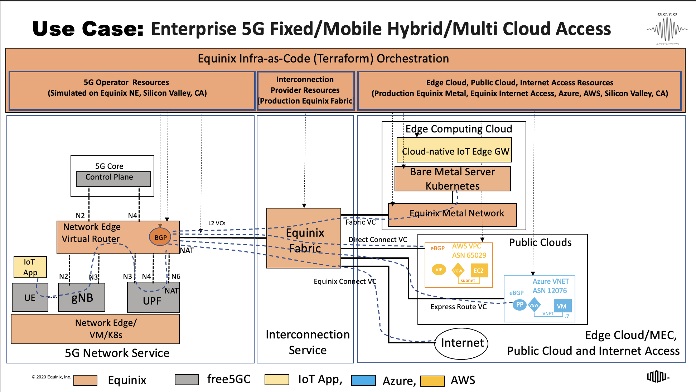
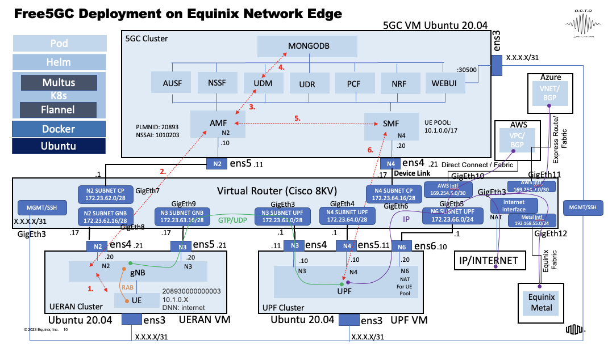

# 5G Enterprise Hybrid Multi-Cloud Demo

This use case demonstrates the “Enterprise 5G Fixed/Mobile Hybrid/Multi-Cloud Access” service, where a simulated, open source based 5G Stand Alone network (including UPF, Control Plane. gNB and UE) is privately interconnected to multiple public clouds, an Edge Computing Cloud and the Internet using Equinix Fabric, Equinix Network Edge, Equinix Metal and Equinix Connect (Internet access) services. 

It shows a fully automated infrastructure deployment using Infra-as-Code tooling (Terraform) of low latency virtual connectivity to AWS and Azure including L2 connections, IP addressing, BGP peering and end-to-end integration with AWS VPC/EC2 and Azure VNET/VM, deployment of an Equinix Metal bare metal server including its end-to-end connectivity to 5G and installation of a Kubernetes cluster, as well as low latency connectivity to the internet. 

At the end of the infrastructure deployment process, we will demonstrate deployment of a cloud native IoT Gateway application on the Edge Computing cloud (on top of Kubernetes) and connectivity from the IoT client app running on the 5G UE to the IoT Gateway as well as private low latency connectivity from the UE to AWS, Azure, Equinix Metal and the Internet. All capabilities in the demo including the simulated 5G Sandbox and Terraform based automation will be based on Equinix production infrastructure and digital services.

## Prerequisites

In order to run this demo, the following is required:

1. Equinix Fabric account.
2. Equinix Metal account.
3. AWS account.
4. Azure account.
5. Terraform (plans are provided in the "terraform" folder.

## Setup

1. Deploy FORTE.
2. Configure virtual router (config provided in the "config" folder).
2. Run Terraform plans: AWS, Azure, Equinix Metal.
3. Verify connectivity.

## Demo design

## Demo configuration

