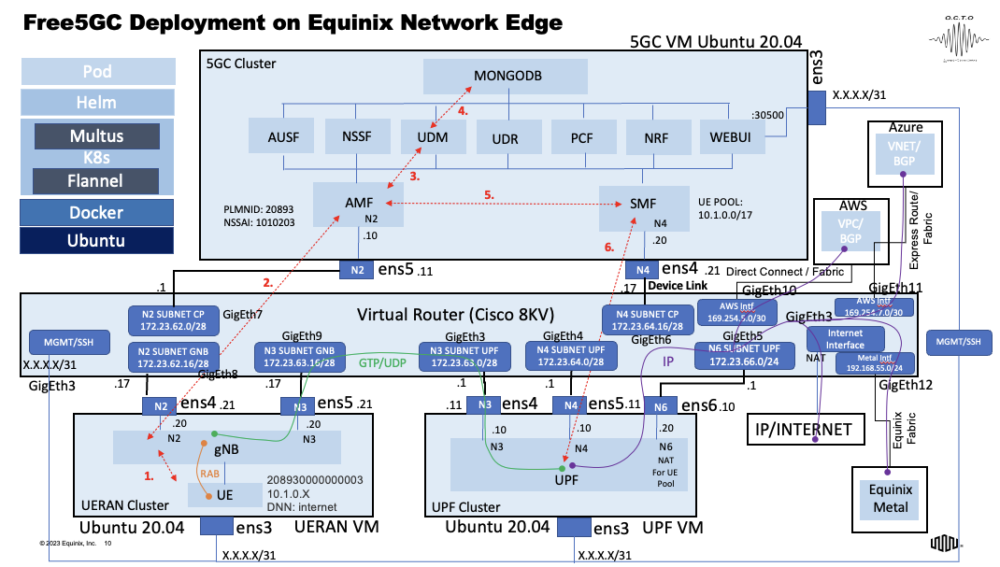

# **FORTE**: **F**ive-G **O**ptimized by **R**eal **T**ime **E**dge

This project describes deployment, operation and troubleshooting of the open-source [Free5GC](https://www.free5gc.org/) package on [Equinix Network Edge](https://www.equinix.com/products/digital-infrastructure-services/network-edge).

## Overview of 5G Stand Alone (SA) Architecture

The 5th Generation of Mobile Networks (a.k.a. 5G) represents a dramatic technological inflection point where the cellular wireless network becomes capable of delivering significant improvements in capacity and performance, compared to the previous generations and specifically the most recent one – 4G LTE.

In 5G, two key parts of the wireless/mobile network receive major upgrades:

* 5G New Radio (5GNR) defines a new air interface structure, new antennae design (massive Multiple Input Multiple Output arrays – mMIMO) and radio transmission methods (beamforming/beam steering).  This enables significant increases in data rates, decreases in the “air interface” latency, as well as the improvements in the capacity (number of connected devices).
* 5G Core (5GC) defines core control (signaling) and user plane (data) capabilities that make use of cloud native virtualization and enable features such as Control and User Plane Separation (CUPS) and Network Slicing.   This allows for the development of unique services not previously available or difficult to implement in 4G.

5G will provide significantly higher throughput than existing 4G networks. Currently 4G LTE is limited to around 150 Mbps. LTE Advanced increases the data rate to 300 Mbps and LTE Advanced Pro to 600Mbps-1 Gbps. The 5G downlink speeds can be up to 20 Gbps. 5G can use multiple spectrum options, including low band (sub 1 GHz, mid-band 1-6 GHz and mmWave 28, 39 GHz). The mmWave spectrum has the largest available contiguous bandwidth capacity (~1000 MHz) and promises dramatic increases in user data rates. 5G enables advanced air interface formats and transmission scheduling procedures that decrease access latency in the Radio Access Network by a factor of 10 compared to 4G LTE.

	    5G fundamental requirements and use cases

5G Service Based Architecture (SBA) is shown below. 
 

		5G Service Based Architecture

The full description of 5G SBA is outside of the scope of this paper. Please refer to 3GPP TS 23.501 for the technical specification of SBA. Below we highlight some SBA functions and interfaces that are relevant to the discussion in this document.

* UE – User Equipment. These are mobile devices equipped with 5G NR capabilities and used for consumer, business, IoT and vehicular applications.
* RAN – Radio Access Network. RAN may further be broken down into the Radio Units (RU), Distributed Units (DU) and Centralized Units (CU). The combination of DU and CU is also referred to as gNB. The UE handovers between gNBs are handled using the Xn interface.
* UPF – User Plane Function. UPF handles Uplink and Downlink data forwarding between the RAN and the Data Networks (DN). The N3 interface is used between gNB and UPF. The N6 interface is used between the UPF and DNs.
* AMF – Access and Mobility Function. AMF is a Control Plane function responsible for UE registration, session and mobility management.
* SMF – Session Management Function. SMF is responsible for bearer and session management including the management of UE IPv4 and IPv6 addressing.
* PCF – Policy Control Function. PCF is responsible for managing and authorizing session parameters for the UE including data rate, QoS and charging.
* NSSF – Network Slice Selection Function. NSSF is responsible for establishing and managing Network Slicing parameters for the UE sessions including the 5GC and Transport domains. NSSF is described in 3GPP TR 28.801.

## FORTE Design

Forte is a deployment of the open-source 5G package - [Free5GC](https://www.free5gc.org/) on [Equinix Network Edge](https://www.equinix.com/products/digital-infrastructure-services/network-edge) platform. The deployment consists of 3 VMs linked to a virtual router. Each VM runs a Kubernetes stack in it (Ubuntu, Docker, K8s, Flannel, Multus, Helm) and the 5G function pods. 

There is a 5G Control Plane cluster (f5gc-cp), 5G User Plane cluster (f5gc-upf) and the simulated UE (device) and GNB (tower) cluster (f5gc-ueran). All are linked to the virtual router (Cisco 8000v) that allows to connect VMs together and to the Internet and Public/Private Clouds via [Equinix Fabric](https://www.equinix.com/products/digital-infrastructure-services/equinix-fabric).

The Forte project is targeted for developers/architects to try out the optimal placement of 5G functions on the edge infra that can be deployed and provisioned in (near) real time. We call it FORTE - Five-G Optimized by Real Time Edge. The detailed design diagram is shown below.

### Virtual Machines

The FORTE deployment consists of four VMs:

1. The Control Plane VM hosting a K8s cluster with 5G CP pods
2. The User Plane VM hosting a K8s cluster with the 5G UPF pod
3. The UERAN VM hosting a K8s cluster with the simulated 5G UE and gNB
4. The VR VM running a virtual router (Cisco 8Kv)

All VMs are pre-installed with the Ubuntu 20.04 OS, Docker, K8s, Helm and all necessary kernel modules and Helm charts for Free5GC. 

On deployment, all pods and network interfaces are expected to start automatically. Also, right after deployment and due to the Free5GC implementation specifics, a series of re-initialization commands needs to be executed to restart all functions and connect the UE (the steps are described in the Initialization section).

The FORTE VM flavors are shown below:

For the Cisco 8Kv VR the minimum flavor is 2 vcpu and 8GB RAM.

On deployment, all Free5GC VMs will receive a DHCP assigned persistant Public IPv4 address for SSH access. All other VM interfaces are pre-configured as shown in the design diagram and the table below.

Please use the table above to create Device Links to connect VM interfaces to the Virtual Router (see below).

The dafault credentials to access Free5GC VMs are: "onaplab/Equinix@1234!"

## FORTE Deployment

To deploy FORTE, you must have access to the Equinix Fabric Portal at [http://fabric.equinix.com]() and Device Tokens to deploy the Free5GC VMs. To obtain Device Tokens please contact Equinix. The deployment process is described below. The expected time to deploy and connect all VMs, including the Cisco 8Kv virtual router, connect the simulated 5G UE and send traffic is approximately 40 min.

### Obtain Device Tokens

Login to the Equinix Fabric Portal and navigate to Service Tokens -> Device Tokens. If you have access to the Free5GC Device Tokens, they will be listed as shown below:

Each token is specific to the type of Free5GC VM (CP, UPF, UE).

### Create Free5GC Devices

In the Equinix Fabric Portal, navigate to the Network Edge tab, select Create Virtual Device and scroll down to the last tile for Device Token. Enter the Device Token as below:

Depending on the token you entered, the next screen will show the Create Device option:

 

Click next to go to next step to select the Metro:

 

Click next to go to next step to specify device details:

Click next to go to next step to specify additional information (ssh ACL):

Click next to go to next step to review and launch the device:

Repeat all steps for the other two Free5GC devices.

### Create the Virtual Router

In the Equinix Fabric Portal, navigate to the Network Edge tab, select Create Virtual Device and scroll down to the Cisco Catalyst 8000v (autonomous mode) tile. Follow the steps below:

Select Cisco Catalyst 8000v (autonomous mode) and go to the next screen: 

Select single device and click next:

Select the Metro and click next:

Select vcpu, RAM and the software packge and go to the next screen.

Specify device name, number of interfaces (**please sele[ct 24**), and the SSH interface (please select "**I will select the interface**" option and choose **GigabitEthernet2**).

Go to the next screen to specify the SSH keys, WAN ACL and launch the device:

### Verify Virtual Devices

After all steps above have been completed, you should see all four virtual devices in the Provisioned state:

### Create Device Links

The Free5GC VMs must be virtually linked to the Cisco 8Kv router. Please use the table below for the device link information (**please make sure to link interfaces as shown in the table**):

Follow the staps below to create device links in the Equinix Fabric Portal.

Go to Network Edge -> Device Link Inventory:

Creat a new DL Group by selecting two existing devices (e.g., UPF and VR):

Specify the DL Name and select interfaces as shown in the DL table above:

Submit the DL for provisioning:

You should see the successful submission screen:

Repeat the steps for other Free5GC devices (CP and UERAN). You should create seven (7) device links in total. Verify that all DLs are provisioned:

